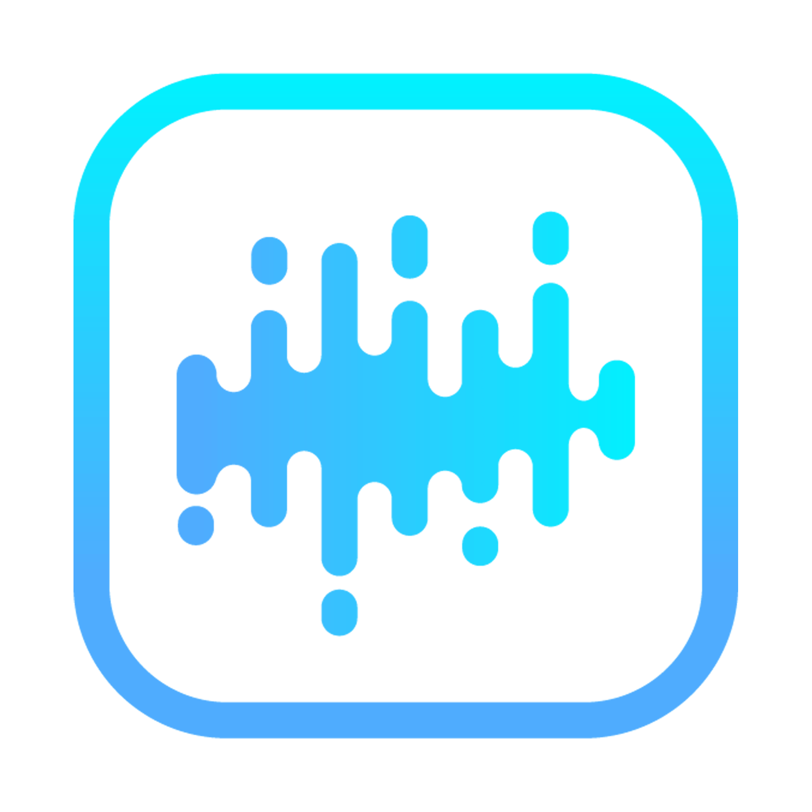
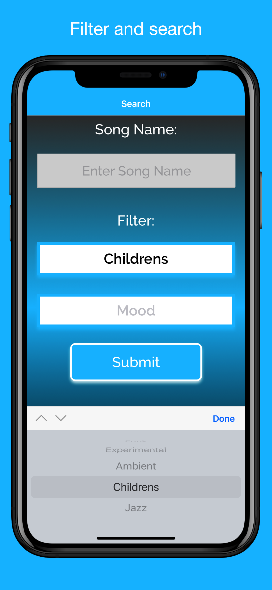
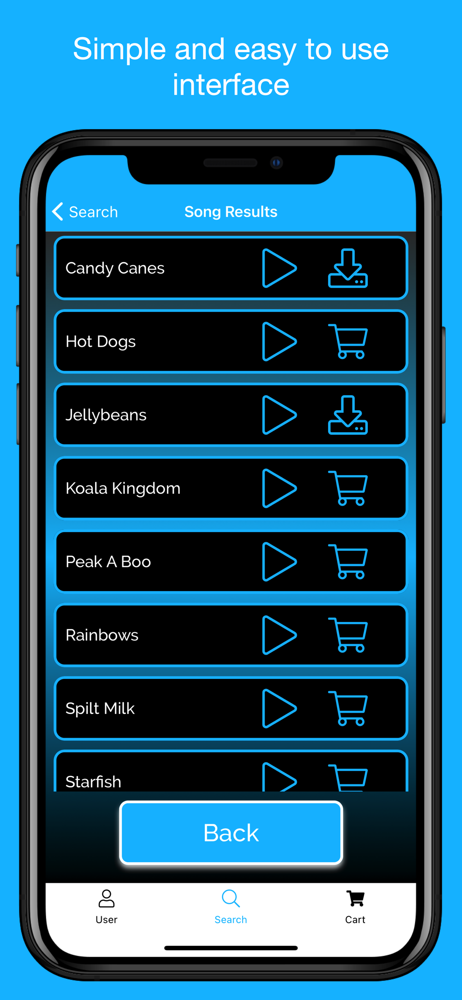
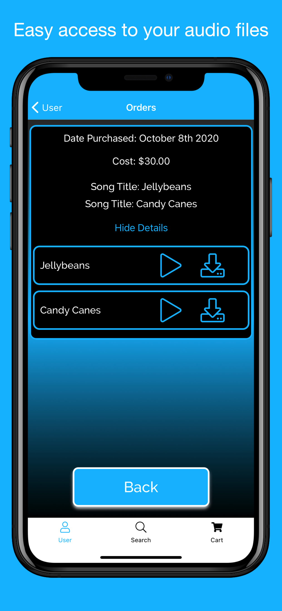
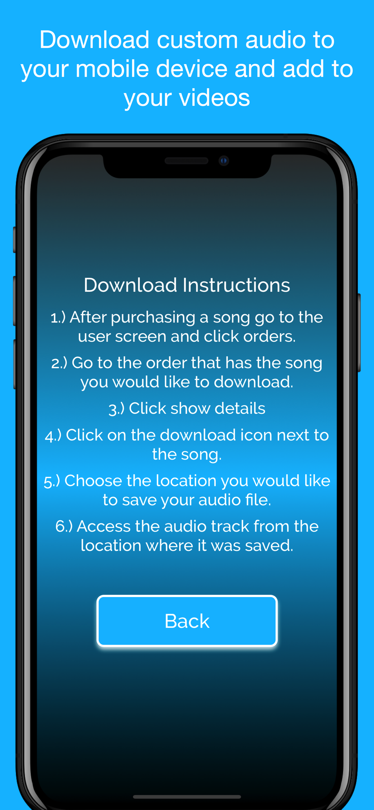

<!--
*** Thanks for checking out this README Template. If you have a suggestion that would
*** make this better, please fork the repo and create a pull request or simply open
*** an issue with the tag "enhancement".
*** Thanks again! Now go create something AMAZING! :D
***

[![Contributors][contributors-shield]][contributors-url]
[![Forks][forks-shield]][forks-url]
[![Stargazers][stars-shield]][stars-url]
[![Issues][issues-shield]][issues-url]
[![MIT License][license-shield]][license-url]
[![LinkedIn][linkedin-shield]][linkedin-url]

<!-- PROJECT LOGO -->
<br />
<p align="center">
  <a>
    
  </a>

  <h3 align="center">ALP Music Mobile</h3>

  <p align="center">
    Mobile music licensing

  </p>
</p>

<!-- ABOUT THE PROJECT -->

## About The Project







### Built With

- React Native
- Firebase
- Expo AV
- Stripe

### Installation

1. Clone the repo

```sh
git clone https://github.com/github_username/repo_name.git
```

2. Install NPM packages

```sh
npm install
```

<!-- USAGE EXAMPLES -->

## Usage

A app for mobile music licensing. After creating an account you can search and filter through lists of custom audio. Once you find an audio track that you like you can purchase and download.

<!-- CONTRIBUTING -->

## Contributing

Contributions are what make the open source community such an amazing place to be learn, inspire, and create. Any contributions you make are **greatly appreciated**.

1. Fork the Project
2. Create your Feature Branch (`git checkout -b feature/AmazingFeature`)
3. Commit your Changes (`git commit -m 'Add some AmazingFeature'`)
4. Push to the Branch (`git push origin feature/AmazingFeature`)
5. Open a Pull Request

<!-- CONTACT -->

## Contact

Darrell Bazian - darrellbazianjr@gmail.com
